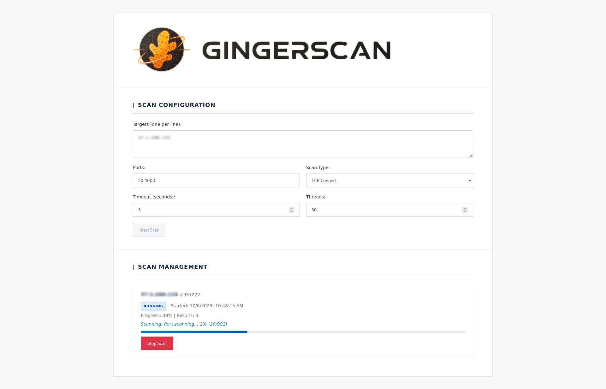
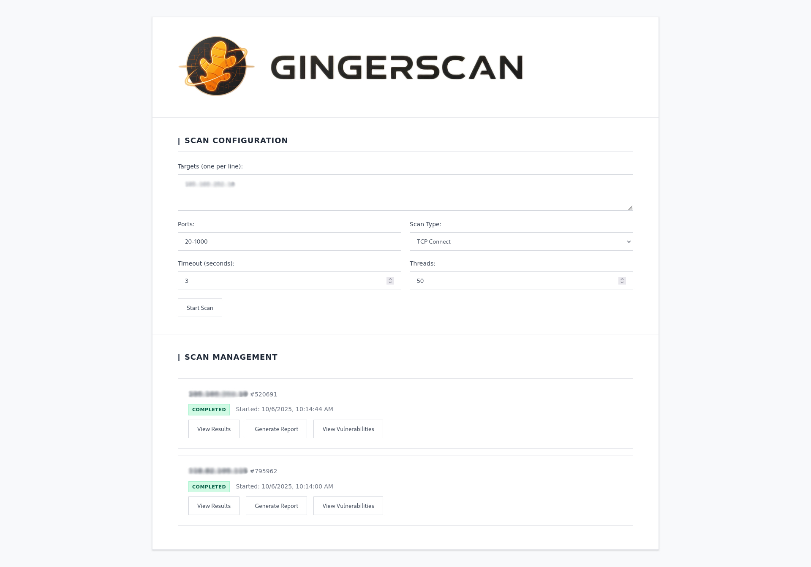
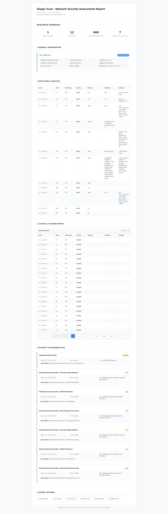

# Ginger Scan
<p align="center">
  
  
</p>


A comprehensive Python toolkit for network scanning, banner grabbing, host discovery, and security assessment. Built with modern Python features including asyncio, type hints, and a modular architecture.

## Features

### Core Functionality
- **Port Scanning**: TCP connect, TCP SYN (Scapy), and UDP scanning with async support
- **Comprehensive Service Detection**: 6-step detection process including banner grabbing, application probes, Nmap integration, TLS detection, protocol fingerprinting, and NSE scripts
- **Sequential Multi-Host Scanning**: Intelligent queue management for scanning multiple hosts one at a time
- **Priority-Based Scan Management**: Smart display sorting (RUNNING > PENDING > COMPLETED)
- **Host Discovery**: ICMP ping sweeps, ARP scanning, and DNS resolution
- **OS Detection**: Operating system fingerprinting using TTL analysis, TCP stack fingerprinting, and banner analysis
- **IP Information Gathering**: Geolocation, ISP, ASN, and network information for each host
- **Output Formats**: JSON, CSV, TXT, PDF, YAML, and Nmap XML compatible
- **Comprehensive Reporting**: HTML, PDF, TXT, CSV, JSON, and YAML reports with host information, OS detection, and vulnerability details
- **Real-time Web Dashboard**: FastAPI-based interface with WebSocket live updates and professional UI
- **Plugin System**: Extensible architecture for custom modules

### Security Features
- **Vulnerability Assessment**: HTTP security headers, server information disclosure
- **Default Credential Checks**: Common service vulnerabilities
- **Comprehensive Shodan API Integration**: Passive reconnaissance, threat intelligence, vulnerability correlation, and honeypot detection
- **Security Reporting**: Color-coded severity levels and detailed findings
- **Rate Limiting**: Configurable scan speed and throttling controls
- **Cancellation Support**: Graceful scan stopping with immediate response
- **Unknown Port Investigation**: Comprehensive analysis of uncommon ports (711, 982, 1337, 31337, etc.)

## Installation

### Quick Start (Recommended)

```bash
git clone https://github.com/mrxcherif/gingerscan.git
cd gingerscan
chmod +x install.sh
./install.sh
```

### Manual Installation

1. Clone and setup:
```bash
git clone https://github.com/mrxcherif/gingerscan.git
cd gingerscan
python3 -m venv venv
source venv/bin/activate  # On Windows: venv\Scripts\activate
```

2. Install dependencies:
```bash
# Full installation (includes WebSocket support for web dashboard)
pip install --upgrade pip
pip install -r requirements.txt

# Install Nmap for comprehensive service detection (recommended)
sudo apt-get install nmap  # Ubuntu/Debian
sudo yum install nmap      # CentOS/RHEL
brew install nmap         # macOS

# Or minimal installation (CLI-only)
pip install -r requirements-minimal.txt
```

> Note: Do not commit your local Python virtual environment directory `venv/`. Add `venv/` to your `.gitignore`.

### Docker Installation

1. Build and run with Docker Compose:
```bash
docker-compose up --build
```

2. Or build and run manually:
```bash
docker build -t gingerscan .
docker run -it --rm --network host gingerscan
```

## Quick Start

### Command Line Interface

```bash
# Basic port scan
python -m tools.scanner --target 192.168.1.1 --ports 1-1000

# Comprehensive scan with all features (sequential multi-host scanning)
python -m tools.scanner --target 192.168.1.0/24 --ports 1-1000 --banner --discover --os-detection --ip-info

# Scan multiple hosts with comprehensive service detection
python -m tools.scanner --target 192.168.1.1,192.168.1.2,192.168.1.3 --ports 1-1000 --banner --os-detection

# Generate comprehensive HTML report with host information
python -m tools.scanner --target 192.168.1.1 --ports 1-1000 --os-detection --ip-info --output report.html --format html

# Load configuration from file
python -m tools.scanner --config config.yaml
```

### Web Dashboard

Start the web interface:
```bash
python -m tools.web_dashboard
```

Access the dashboard at `http://localhost:8000`

**Dashboard Features:**
- **Sequential Multi-Host Scanning**: Scan multiple hosts one at a time with queue management
- **Priority-Based Display**: Running scans at top, pending in middle, completed at bottom
- **Professional Messaging**: Context-aware scan start messages
- **Real-time Progress**: Live updates with detailed phase information (ARP scan, OS detection, IP gathering, Port scanning)
- **Enhanced Service Detection**: 6-step service identification process
- **Comprehensive Reports**: Export in HTML, PDF, TXT, CSV, JSON, YAML formats
- **Host Information**: Geolocation, ISP, ASN data in all report formats
- **Graceful Cancellation**: Stop scans immediately with automatic next scan progression

## Dashboard Preview

Here's a look at the interactive web dashboard built with FastAPI:

<p align="center">
  
</p>

<p align="center">
  
</p>

<p align="center">
  
</p>

## Configuration

Create a `config.yaml` file:

```yaml
targets:
  - 192.168.1.0/24
  - 10.0.0.1

ports:
  - 1-1000
  - 22,80,443,8080

scan_options:
  timeout: 3
  rate_limit: 100
  threads: 50

output:
  format: json
  file: scan_results.json

banner_grabbing:
  enabled: true
  timeout: 5

# Comprehensive service detection
service_detection:
  enabled: true
  use_nmap: true
  timeout: 10
  steps:
    - banner_grab
    - application_probes
    - tls_detection
    - nmap_version
    - protocol_fingerprint
    - nse_scripts

discovery:
  icmp_ping: true
  arp_scan: true
  dns_resolution: true

# IP information gathering
ip_info:
  enabled: true
  timeout: 5
  include_geolocation: true
  include_asn: true
```

## Project Structure

```
gingerscan/
├── __init__.py
├── __main__.py
├── assets/
│   ├── logo.png
│   ├── text.png
│   ├── Screenshot1.jpg
│   ├── Screenshot2.jpg
│   └── Screenshot3.jpg
├── config/
│   ├── default.yaml
│   └── local.yaml
├── docker-compose.yml
├── Dockerfile
├── docs/
│   ├── design.md
│   ├── roadmap.md
│   ├── shodan_integration.md
│   └── usage.md
├── install.sh
├── LICENSE
├── logs/
├── PROJECT_SUMMARY.md
├── README.md
├── reports/
├── requirements-minimal.txt
├── requirements.txt
├── scripts/
│   ├── parse_output.sh
│   └── run_scan.sh
├── SETUP_GUIDE.md
├── setup.py
├── tests/
│   ├── test_parser.py
│   ├── test_reporter.py
│   └── test_scanner.py
└── tools/
    ├── __init__.py
    ├── banner_grabber.py
    ├── cli.py
    ├── comprehensive_service_detector.py
    ├── discover.py
    ├── enhanced_service_detector.py
    ├── ip_info.py
    ├── os_detection.py
    ├── parser.py
    ├── reporter.py
    ├── scanner.py
    ├── shodan_client.py
    ├── vuln_checks.py
    └── web_dashboard.py
```

## Examples

### Sample Scan Results

```json
{
  "scan_info": {
    "target": "192.168.1.1",
    "start_time": "2024-01-01T10:00:00Z",
    "duration": 45.2
  },
  "hosts": [
    {
      "ip": "192.168.1.1",
      "hostname": "router.local",
      "ports": [
        {
          "port": 22,
          "protocol": "tcp",
          "state": "open",
          "service": "ssh",
          "banner": "SSH-2.0-OpenSSH_8.2p1"
        }
      ]
    }
  ]
}
```

## Development

### Running Tests

```bash
pytest tests/ -v
```

### Code Style

This project follows PEP 8 and uses:
- Type hints for all functions
- Black for code formatting
- Flake8 for linting
- MyPy for type checking

## Contributing

1. Fork the repository
2. Create a feature branch
3. Make your changes
4. Add tests for new functionality
5. Submit a pull request

## Connect

- LinkedIn: [Mr Cherif](https://www.linkedin.com/in/mrxcherif/)

## License

This project is licensed under the MIT License - see the [LICENSE](LICENSE) file for details.

## Comprehensive Service Detection

The tool features a sophisticated 6-step service detection process:

1. **Banner Grab**: Simple connection and banner reading
2. **Application Probes**: Service-specific probes (HTTP GET, SMTP EHLO, FTP USER, MySQL handshake, Redis PING, etc.)
3. **TLS Detection**: SSL/TLS certificate analysis and cipher identification
4. **Nmap Analysis**: Industry-standard `nmap -sV` version detection
5. **Protocol Fingerprinting**: Response pattern analysis and binary protocol detection
6. **NSE Scripts**: Nmap Scripting Engine for vulnerability detection

**Requirements for Full Functionality**:
```bash
# Install Nmap for best results
sudo apt-get install nmap  # Ubuntu/Debian
sudo yum install nmap      # CentOS/RHEL
brew install nmap         # macOS
```

**Service Detection Results**:
- **High Confidence (0.8-1.0)**: SSH, HTTP, HTTPS, FTP, SMTP, MySQL, etc.
- **Medium Confidence (0.5-0.7)**: Custom applications with clear patterns
- **Unknown Services (0.1-0.4)**: Ports requiring manual investigation (711, 982, 1337, etc.)

## Roadmap

- [x] Comprehensive service detection with Nmap integration
- [x] Sequential multi-host scanning
- [x] Priority-based scan management
- [x] Professional web dashboard
- [x] Enhanced reporting with host information
- [x] Graceful scan cancellation
- [ ] Additional vulnerability checks
- [ ] Integration with more security APIs
- [ ] Advanced reporting features
- [ ] Mobile app for scan monitoring
- [ ] Cloud deployment templates

## Security Notice

This tool is for authorized security testing only. Always ensure you have permission to scan the target networks. The authors are not responsible for any misuse of this software.
